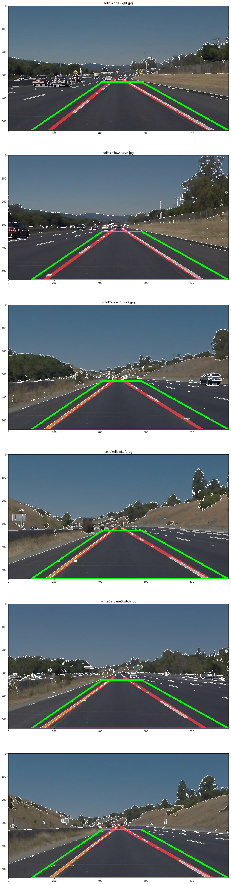

# Finding Lane Lines on the Road

**Finding Lane Lines on the Road**

The goals / steps of this project are the following:
* Make a pipeline that finds lane lines on the road
* Reflect on your work in a written report

---

## Reflection

##1. Describe your pipeline. As part of the description, explain how you modified the draw_lines() function.

My pipeline consisted of following steps:

1. First, I converted the images to grayscale. 
2. Second, clipped the regions to only the part which would contain lane lines,
3. then, I applied a guassian blur
4. used a Canny filter to get edges
5. next I used the Hough transform to get lines from this image of edges.
6. I then split the lines into left and right but using their slope,
7. Next I filtered out lines that were different from the mean slope by 1 std deviation, 
8. calculated the centroid of left and right lane vertices to get a single left and right point, 
9. calculated the weighted (by magnitude of the line) slope of left and right lines, 
10. and then drew a line using the point and the slope for both left and right lanes.
11. I combined these lines with the original image.

In order to draw a single line on the left and right lanes, I modified the draw_lines() function in the following way:

1. I collected all the lines with a negative slope and marked them as LEFT lines. 
2. All lines with positive sloped lines I marked as RIGHT lines. 
3. Then for Left & Right lines I removed all lines that were more that a standard deviatiion from the mean.
4. Then I found the centeroid of the points for both left and righ lines. 
5. Next, I found the weighted slope of left and right lines. 
6. Using the centroid and weighted slope for both left and right lines, I calculated the intersection of this line with the top of the clipped regoin and the bottom of the image. 
7. Using these two intersection points I drew 2 lines for left and right annontations.

This image shows the combination of all the different transforms for the test_images: 

1. The Canny edges are white,
2. the clipped area is in green
2. the detected lines are blue
3. the final drawn lines are in red

##2. Identify potential shortcomings with your current pipeline

One potential shortcoming would occur on very sharp turns my pipeline would not take into account the lines which were a standard deviation different from the mean. This means that it would not be able to cater to steep turns. 

Another shortcoming could be that the clipping mask is static so again it would not be able to cater to turns. 

I *plan to fix these shortcomings*. 

##3. Suggest possible improvements to your pipeline

A possible improvement would be to make the clipping mask dynamic. This way we could make sure we minimize the possibilty of noise from non road elements like dividers, trees, sky especially on turns.

Another potential improvement could be to use a combination of piece wise lines instead of using 1 straight line. This would allow us to track turns. 
